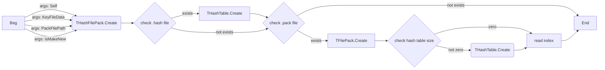
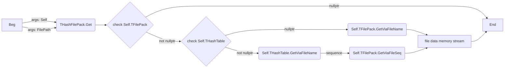
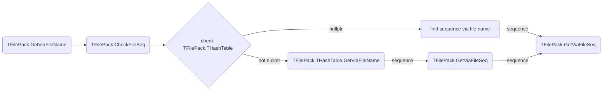

## Structure

### File Structures

```c
template<class T>
struct Str_t
{
    uint16_t name_char_count;
    Array<T, name_char_count> name_buffer;
};

struct Sig_t
{
    Array<uint8_t, 16> signature;
};

struct QLIE_FilePack_t
{
    struct Index_t
    {
        struct Entry_t
        {
            struct Info_t
            {
                uint64_t foa; // File Offset Address
                uint32_t enc_size;
                uint32_t org_size;
                uint32_t compress_flag;
                uint32_t cryptor_version;
                uint32_t check_key;
            };
    
            Str_t<char16_t> file_name;
            Info_t file_info;
        };
        
        Array<Entry_t, header.info.nFileCount> index;
    };
    
    struct HashTable_t
    {
        struct Header_t
        {
            Sig_t signature;
            uint32_t table_size;
            uint32_t file_count;
            uint32_t map_seq_table_size;
            uint32_t hash_table_enc_size;
            uint32_t table_cryptor_type;
            uint32_t file_safty_data_size;
            uint32_t file_string_hash_version;
            uint32_t un3;
            uint32_t un4;
            uint32_t un5;
            uint32_t un6;
            uint32_t un7;
            uint32_t un8;
        };

        struct Linked_t
        {
            struct Info_t
            {
                Str_t<char16_t> file_name;
                uint64_t file_map_seq_table_seq;
                uint32_t file_name_hash;
            };

            uint32_t file_count;
            Array<Info_t, file_count> file_index;
        };
    
        Header_t header;
        Array<Linked_t, header.table_size> table; // compressed
    };
    
    struct Header_t
    {
        struct Cryptor_t
        {
            Array<uint8_t, 32> check_str;
            uint32_t hash_table_size; 
            Array<uint8_t, 256> key_table; 
            uint32_t unknown_flag;
            Array<uint8_t, 0x2FC> unknown_table;
        };
    
        struct Info_t
        {
            Sig_t signature; // 'FilePackVer3.1'
            uint32_t file_count;
            uint64_t data_size;
        };
    
        Cryptor_t cryptor;
        Info_t info;
    };
    
    Array<uint8_t, header.info.data_size> files_data;
    Index_t files_index;
    HashTable_t hash_table;
    Header_t header;
}

struct ABMP12
{
    struct ABDat15_t
    {
        Sig_t signature; // 'abdata15'
        uint32_t data_size;
        Array<uint8_t, data_size> abdat; // compressed
    };

    struct ABImage10_t
    {
        struct ImgDat15_t
        {
            Sig_t signature; // 'abimgdat15'
            uint32_t virtual_flag;
            Str_t<char16_t> file_name;
            Str_t<char8_t> hash_name; // sjis encoding
            uint8_t type; // 0=.bmp  1=.jpg  2,3=.png  4=.m  5=.argb  6=.b  7=.ogv  8=.mdl
            uint32_t offset_x;
            uint32_t offset_y;
            uint32_t offset_z;
            if (virtual_flag >= 2)
            {
                uint32_t virtual_width;
                uint32_t virtual_height;
                uint32_t virtual_depth;
            }
            uint8_t rendering_texture_mode;
            uint32_t rendering_texture_bg_color;
            uint32_t data_size;
        };

        Sig_t signature; // 'abimage10'
        uint8_t imgdat_count;
        Array<ImgDat15_t, data_count> imgdat_list;
    };

    struct ABSound10_t
    {
        struct SndDat12_t
        {
            Sig_t signature; // 'absnddat12'
            uint32_t flag;
            Str_t<char16_t> file_name;
            Str_t<char8_t> hash_name; // sjis encoding
            uint8_t type; // 0=.wav  1=.ogg
            uint32_t data_size;
        };

        Sig_t signature; // 'absound10'
        uint8_t snddat_count;
        Array<SndDat12_t, data_count> snddat_list;
    };

    Array<uint8_t, 16> signature; // 'abmp12'
    ABData15_t abdata;
    ABImage10_t abimage;
    ABSound10_t absound;
}
```

### Memory Structures

```c
struct TStream_Vtable
{
  void *fnGetSize;
  void *fnSetSize;
  void *fnxx;
  void *fnRead;
  void *fnWrite;
  void *fnxxxxx;
  void *fnSetPos;
  void *fnxxxxxxx;
};

struct TStream
{
  TStream_Vtable *pVtable;
  uint32_t un1;
  uint32_t un2;
  uint32_t un3;
  uint32_t un4;
  uint32_t un5;
};

struct TMemoryStream
{
  TStream_Vtable *pVtable;
  uint8_t *pData;
  uint32_t nSize;
  uint32_t nPos;
  uint32_t un3;
  uint32_t un4;
};

struct TFileStream
{
  TStream_Vtable *pVtable;
  uint32_t hFile;
  LPWSTR wpFilePath;
  uint32_t un1;
};

struct __attribute__((aligned(8))) TFilePack
{
  uint8_t gap0[4];
  THashTable *pPackHashTable;
  TStream *tsFile;
  TFilePack_Entry_Info *aFileInfoList;
  LPCWSTR *aFileNameList;
  uint32_t nResFileCount;
  uint64_t nAllResFileDataSize;
  uint8_t isFreePackFileStream;
  LPWSTR wsPackFileName;
  uint64_t PackFileBeginPos;
  uint64_t PackFileEndPos;
  uint32_t aFMode;
  uint32_t unx;
  uint32_t fnLocker1;
  uint32_t pLocker;
  void *fnLocker1;
  uint8_t isPackFileErro;
  uint32_t nCryptorKey;
  uint8_t aCryptorTable[256];
  uint8_t nxxx[7];
  uint8_t isFMakeMemoryStreamMode;
  TMemoryStream *pKeyFileCryptorTable;
  uint32_t nLastReadResFileAfterDecSize;
  uint32_t nLastReadResFileBeforeDecSize;
  uint16_t un2;
};

struct __attribute__((packed)) __attribute__((aligned(4))) TFilePack_Entry_Info
{
  uint64_t nPos;
  uint32_t nEncSize;
  uint32_t nOrgSize;
  uint32_t isCompress;
  uint32_t nCryptorVersion;
  uint32_t nCheckKey;
};

struct THashTable
{
  uint32_t un1;
  uint32_t TableSize;
  uint32_t FTableMask;
  THashTableInfo **pHashTableInfoArray;
  uint32_t *pHashTableCountArray;
  TStream *pMapSeqTableSize;
  uint32_t FDataCount;
  uint32_t FCache;
  uint32_t nFSaftyDataSize;
  uint32_t FStringHashVersion;
  uint32_t unc;
};

struct __attribute__((aligned(8))) THashTableInfo
{
  LPWSTR wpFilePath;
  uint32_t un0;
  uint64_t nMapTableSeq;
  uint32_t nFileNameHash;
  uint32_t nSaftySize;
};

struct __attribute__((aligned(4))) THashFilePack
{
  _BYTE gap0[4];
  _BYTE isFError;
  THashTable *pHashTable;
  TFilePack *pTFilePack;
  LPWSTR strHashFilename;
  LPWSTR strPackFilename;
  uint32_t un4;
};

struct TAnimationBMP
{
  uint32_t dword0;
  uint32_t un0;
  uint8_t gap4[12];
  uint32_t un1;
  uint32_t FLoadVersion;
  uint32_t FCurrentVersion;
  LPWSTR wpFilePath;
  uint8_t isFEditMode;
  uint32_t FMemoryBlockPool;
  uint32_t FUseImageList;
  uint32_t FUseImageListx;
  uint32_t FUseSoundList;
  uint32_t unx11;
  uint32_t FPreMotion;
  uint32_t aTable[256];
  uint32_t FPlaySpeed;
  uint32_t e0;
  uint32_t e1;
  uint32_t e2;
  uint32_t e3;
  uint32_t FSoundVolume;
  uint32_t e5;
  uint32_t e6;
  uint32_t FTempNo;
  uint32_t FWaveInputMul;
  uint32_t FSND;
  uint32_t FKeyStack;
  uint32_t FExternalGlobalTime;
  uint32_t FExternalMouseX;
  uint32_t FExternalMouseY;
  uint32_t CollisionStack;
  uint32_t FExternalArg;
  uint32_t dword484;
  uint32_t aUnTable0[4];
  uint32_t aUnTable1[4];
  uint8_t isFTemplateLoad;
  TABMPData10 *Data;
  TABMPImage10 *Image;
  TABMPSound10 *Sound;
  uint32_t CollisionStack_;
  uint8_t isDrawInformation;
  uint8_t isDrawCollision;
  uint32_t EditLayerNo;
  uint8_t isDrawCurrentLayerOnly;
  uint32_t MotionPlayTime;
  uint32_t aTable1[256];
  uint32_t aTable2[256];
  uint32_t aTable3[256];
  uint32_t gap4C5[15];
  uint32_t ExternalRepTable;
  uint32_t ExternalRepTable;
  uint32_t unx1;
  uint32_t unx2;
  uint32_t unx3;
  uint32_t unx4;
  uint32_t unx5;
  uint32_t unx6;
  uint32_t unx7;
  uint32_t unx8;
  uint32_t unx9[25];
};

struct TABMPSound10
{
  uint32_t un0;
  uint32_t un1;
  uint32_t un2;
  uint32_t un3;
  uint32_t FEditMode;
  uint32_t un5;
  uint32_t FLoadVersion;
  uint32_t FCurrentVersion;
  uint32_t un8;
  uint32_t FData;
  uint32_t FName;
  uint32_t SaveMode;
  uint32_t SoundFileData;
  uint32_t WaveData;
  uint32_t HashCode;
  uint32_t unF;
  uint32_t unG;
};

struct TABMPSoundData10
{
  uint32_t un0;
  uint32_t un1;
  uint32_t un2;
  uint32_t un3;
  uint32_t un4;
  uint32_t un5;
  uint32_t FLoadVersion;
  uint32_t un7;
  uint32_t un8;
  uint32_t PreSaveMode;
  uint32_t FName;
  uint32_t SaveMode;
  uint32_t SoundFileData;
  TStream *WaveData;
  uint32_t HashCode;
  uint32_t unf;
};

struct TABMPImage10
{
  uint32_t un0;
  uint32_t un1;
  uint32_t un2;
  uint32_t un3;
  uint32_t FEditMode;
  uint32_t un5;
  uint32_t FLoadVersion;
  uint32_t FCurrentVersion;
  uint32_t un8;
  uint32_t FSND;
  uint32_t FData;
  uint32_t unB;
  uint32_t unC;
  uint32_t unD;
  uint32_t unE;
  uint32_t unF;
  uint32_t unG;
  uint32_t unH;
  uint32_t unI;
};

struct TABMPImageData10
{
  uint32_t un0;
  uint32_t un1;
  uint32_t un2;
  uint32_t un3;
  uint32_t un4;
  uint32_t un5;
  uint32_t FLoadVersion;
  uint32_t un7;
  uint32_t un8;
  uint32_t PreSaveMode;
  LPWSTR FFilterOP;
  uint32_t FARGB8888Data;
  uint32_t FChangedImage;
  uint32_t FMovie;
  uint32_t FTheora;
  uint32_t FModel;
  uint32_t FAnimation;
  uint32_t FOffsetX;
  uint32_t FOffsetY;
  uint32_t FOffsetZ;
  uint32_t FVirtualWidth;
  uint32_t FVirtualHeight;
  uint32_t FVirtualDepth;
  uint32_t FName;
  uint32_t un2e;
  uint32_t FRenderingTexture;
  uint32_t FRenderingTextureTime;
  uint32_t un5e;
  uint32_t FRenderingTextureBGColor;
  uint32_t FRenderingTextureMode;
  uint32_t un8e;
  uint32_t un9e;
  uint32_t unae;
  uint32_t un0d;
  uint32_t un1d;
  uint32_t un2d;
  uint32_t un3d;
  uint32_t un4d;
  uint32_t un5d;
  uint32_t un6d;
  uint32_t un7d;
  uint32_t un8d;
  uint32_t un9d;
  uint32_t unad;
  uint32_t un0h;
  uint32_t un1h;
  uint32_t un2h;
  uint32_t un3h;
  uint32_t un4h;
  uint32_t un5h;
  uint32_t un6h;
  uint32_t un7h;
  uint32_t un8h;
  uint32_t un9h;
  uint32_t unah;
  uint32_t un0o;
  uint32_t un1o;
  uint32_t un2o;
  uint32_t un3o;
  uint32_t un4o;
  uint32_t un5o;
  uint32_t un6o;
  uint32_t un7o;
  uint32_t un8o;
  uint32_t un9o;
  uint32_t unao;
  uint32_t un0q;
  uint32_t un1q;
  uint32_t un2q;
  uint32_t un3q;
  uint32_t SaveMode;
  TMemoryStream *ImageFileData;
  LPWSTR HashCode;
  uint32_t un7q;
  uint32_t un7q1;
  uint32_t un7q2;
};

struct TABMPData10
{
  uint32_t un0;
  uint32_t un1;
  uint32_t un2;
  uint32_t un3;
  uint32_t un4;
  uint32_t un5;
  uint32_t FLoadVersion;
  uint32_t un7;
  uint32_t un8;
  uint32_t un9;
  uint32_t name;
  uint32_t unB;
  uint32_t SizeWidth;
  uint32_t SizeHeight;
  uint32_t SizeDepth;
  uint32_t Memo;
  uint32_t unG;
  uint32_t unH;
  uint32_t unI;
};

struct QLIE_Delphi_Str
{
  uint32_t nLen;
  wchar_t *wpStr;
};

```


## Comments

- QLIE_FilePack_t::Header_t::Info_t::signature // 识别标志字符串，不区分大小写
- QLIE_FilePack_t::Header_t::Cryptor_t::hash_table_size // 如果为0则不读取hash table 或 hash table存储在单独的文件中(.hash) 或 没有hash table(没有hash table则通过一个个文件名对比来查找文件)
- QLIE_FilePack_t::Header_t::Cryptor_t::key_table // 用于解密check_str和文件名
- QLIE_FilePack_t::Header_t::Cryptor_t::check_str // 加密过的字符串，使用key_table解密后和内部的字符串(`8hr48uky,8ugi8ewra4g8d5vbf5hb5s6`)对比，如果不一样则抛出异常


## Functions

- 004EE0A8 从keyfile(在exe的resources(RCData::RESKEY)里，每个封包也有keyfile文件(pack_keyfile_...key))生成解密表，主要用于解密文件数据
- 004EE18E 检查signature
- 004EDE32 通过key_table生成nCryptorKey，主要用于解密check_str和文件名
- 004EDE52 用nCryptorKey解密check_str
- 004EDE78 对比解密后的check_str是否等于`8hr48uky,8ugi8ewra4g8d5vbf5hb5s6`
- 004EDF7E 循环读取每一项文件描述（读取索引表）
- 004EDF96 读取文件名的同时通过nCryptorKey解密文件
- 004EE754 查找目标文件的索引下标，有hash table则通过hash tabel查找，没有则strcmp
- 004EDB80 通过下标索引，读取返回对应的MemoryStream
- 004EDC4C 对原始的文件数据计算校验key并判断是否和存储的校验key一致
- 004EDC93 判断是否需要解密及解密版本
- 004EDCC0 判断是否需要解压
- 004F06CF 循环打开封包（最大32个，即最多32个封包，即封包序号最大31）


## Graph

- 打开现有封包的粗略流程



- 从封包读取的粗略流程


在THashFilePack没有HashTable的情况下会通过TFilePack.GetViaFileName读取文件，而TFilePack也有可能持有HashTable，如果没有则一个个文件名对比


