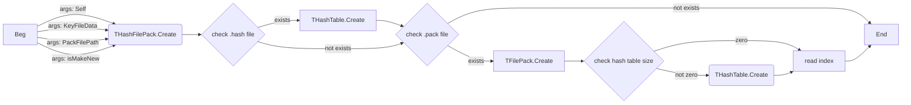
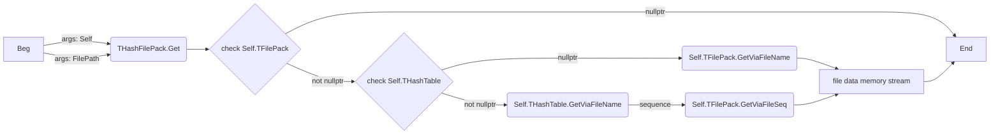
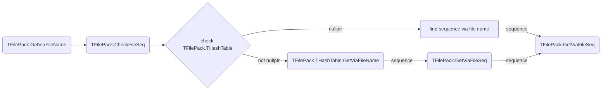

## Structure

```c
template<class T>
struct Str_t
{
    uint16_t name_char_count;
    Array<T, name_char_count> name_buffer;
};

struct Sig_t
{
    Array<uint8_t, 16> signature;
};

struct QLIE_FilePack_t
{
    struct Index_t
    {
        struct Entry_t
        {
            struct Info_t
            {
                uint64_t foa; // File Offset Address
                uint32_t enc_size;
                uint32_t org_size;
                uint32_t compress_flag;
                uint32_t cryptor_version;
                uint32_t check_key;
            };
    
            Str_t<char16_t> file_name;
            Info_t file_info;
        };
        
        Array<Entry_t, header.info.nFileCount> index;
    };
    
    struct HashTable_t
    {
        struct Header_t
        {
            Sig_t signature;
            uint32_t table_size;
            uint32_t file_count;
            uint32_t map_seq_table_size;
            uint32_t hash_table_enc_size;
            uint32_t table_cryptor_type;
            uint32_t file_safty_data_size;
            uint32_t file_string_hash_version;
            uint32_t un3;
            uint32_t un4;
            uint32_t un5;
            uint32_t un6;
            uint32_t un7;
            uint32_t un8;
        };

        struct Linked_t
        {
            struct Info_t
            {
                Str_t<char16_t> file_name;
                uint64_t file_map_seq_table_seq;
                uint32_t file_name_hash;
            };

            uint32_t file_count;
            Array<Info_t, file_count> file_index;
        };
    
        Header_t header;
        Array<Linked_t, header.table_size> table; // compressed
    };
    
    struct Header_t
    {
        struct Cryptor_t
        {
            Array<uint8_t, 32> check_str;
            uint32_t hash_table_size; 
            Array<uint8_t, 256> key_table; 
            uint32_t unknown_flag;
            Array<uint8_t, 0x2FC> unknown_table;
        };
    
        struct Info_t
        {
            Sig_t signature; // 'FilePackVer3.1'
            uint32_t file_count;
            uint64_t data_size;
        };
    
        Cryptor_t cryptor;
        Info_t info;
    };
    
    Array<uint8_t, header.info.data_size> files_data;
    Index_t files_index;
    HashTable_t hash_table;
    Header_t header;
}

struct ABMP12
{
    struct ABDat15_t
    {
        Sig_t signature; // 'abdata15'
        uint32_t data_size;
        Array<uint8_t, data_size> abdat; // compressed
    };

    struct ABImage10_t
    {
        struct ImgDat15_t
        {
            Sig_t signature; // 'abimgdat15'
            uint32_t virtual_flag;
            Str_t<char16_t> file_name;
            Str_t<char8_t> hash_name; // sjis encoding
            uint8_t type; // 0=.bmp  1=.jpg  2,3=.png  4=.m  5=.argb  6=.b  7=.ogv  8=.mdl
            uint32_t offset_x;
            uint32_t offset_y;
            uint32_t offset_z;
            if (virtual_flag >= 2)
            {
                uint32_t virtual_width;
                uint32_t virtual_height;
                uint32_t virtual_depth;
            }
            uint8_t rendering_texture_mode;
            uint32_t rendering_texture_bg_color;
            uint32_t data_size;
        };

        Sig_t signature; // 'abimage10'
        uint8_t imgdat_count;
        Array<ImgDat15_t, data_count> imgdat_list;
    };

    struct ABSound10_t
    {
        struct SndDat12_t
        {
            Sig_t signature; // 'absnddat12'
            uint32_t flag;
            Str_t<char16_t> file_name;
            Str_t<char8_t> hash_name; // sjis encoding
            uint8_t type; // 0=.wav  1=.ogg
            uint32_t data_size;
        };

        Sig_t signature; // 'absound10'
        uint8_t snddat_count;
        Array<SndDat12_t, data_count> snddat_list;
    };

    Array<uint8_t, 16> signature; // 'abmp12'
    ABData15_t abdata;
    ABImage10_t abimage;
    ABSound10_t absound;
}
```


## Comment

QLIE_FilePack_t::Header_t::Info_t::signature // 识别标志字符串，不区分大小写
QLIE_FilePack_t::Header_t::Cryptor_t::hash_table_size // 如果为0则不读取hash table 或 hash table存储在单独的文件中(.hash) 或 没有hash table(没有hash table则通过一个个文件名对比来查找文件)
QLIE_FilePack_t::Header_t::Cryptor_t::key_table // 用于解密check_str和文件名
QLIE_FilePack_t::Header_t::Cryptor_t::check_str // 加密过的字符串，使用key_table解密后和内部的字符串(`8hr48uky,8ugi8ewra4g8d5vbf5hb5s6`)对比，如果不一样则抛出异常


## Function

// 004EE0A8 从keyfile(在exe的resources(RCData::RESKEY)里，每个封包也有keyfile文件(pack_keyfile_...key))生成解密表，主要用于解密文件数据
// 004EE18E 检查signature
// 004EDE32 通过key_table生成nCryptorKey，主要用于解密check_str和文件名
// 004EDE52 用nCryptorKey解密check_str
// 004EDE78 对比解密后的check_str是否等于`8hr48uky,8ugi8ewra4g8d5vbf5hb5s6`
// 004EDF7E 循环读取每一项文件描述（读取索引表）
// 004EDF96 读取文件名的同时通过nCryptorKey解密文件

// 004EE754 查找目标文件的索引下标，有hash table则通过hash tabel查找，没有则strcmp
// 004EDB80 通过下标索引，读取返回对应的MemoryStream
// 004EDC4C 对原始的文件数据计算校验key并判断是否和存储的校验key一致
// 004EDC93 判断是否需要解密及解密版本
// 004EDCC0 判断是否需要解压

// 004F06CF 循环打开封包（最大32个，即最多32个封包，即封包序号最大31）


## Graph

- 打开现有封包的粗略流程



- 从封包读取的粗略流程


在THashFilePack没有HashTable的情况下会通过TFilePack.GetViaFileName读取文件，而TFilePack也有可能持有HashTable，如果没有则一个个文件名对比


